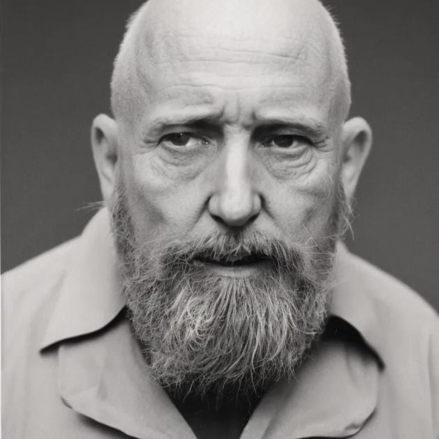
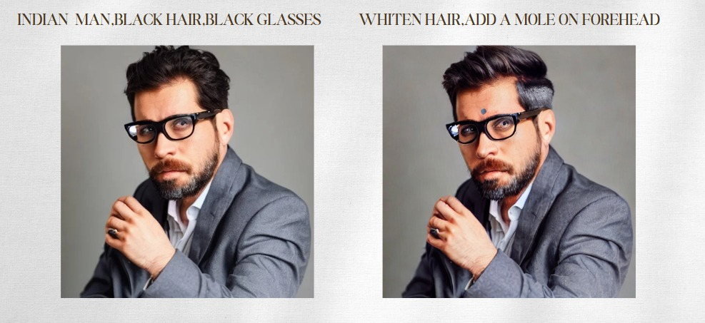
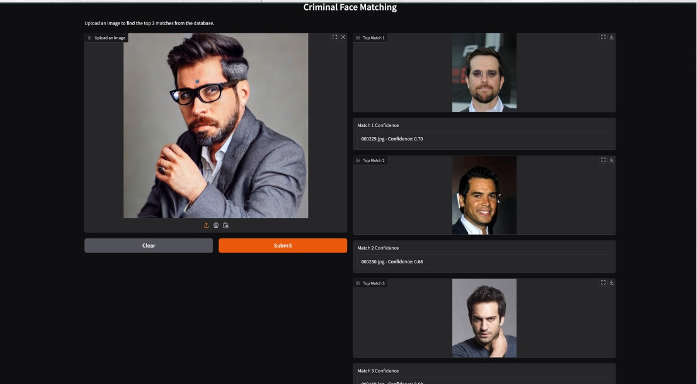
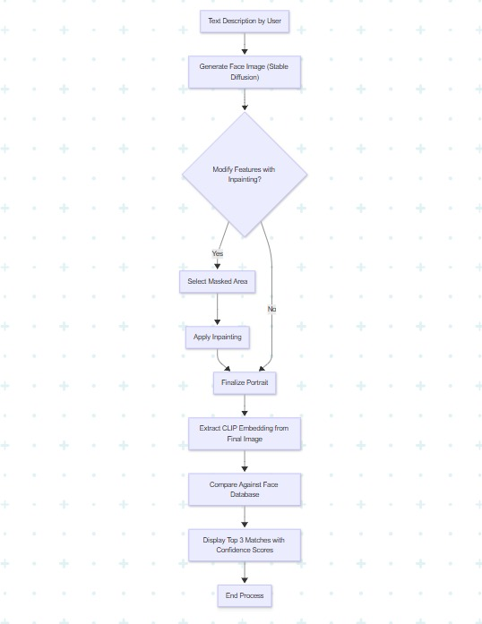

# FaceForgeAI – AI-Powered Portrait Generation & Editing

**Generate and modify realistic human portraits from natural language descriptions using Stable Diffusion.**  
Designed for **forensics, investigations, and creative industries**, FaceForge AI turns witness descriptions into accurate portraits, allows targeted edits, and matches against a face database for possible identity suggestions.

---

##  Table of Contents
- [Overview](#-overview)
- [Features](#-features)
- [Tech Stack](#-tech-stack)
- [Project Workflow](#-project-workflow)
- [Screenshots](#-screenshots)
- [Flowchart](#-flowchart)
- [Getting Started](#-getting-started)
- [Usage](#-usage)
- [Future Improvements](#-future-improvements)

---

##  Overview
FaceForge AI enables **text-driven portrait creation and targeted facial modifications**.  
The system follows these key steps:
1. **Generate** a face from a natural language description.
2. **Edit** specific facial features using inpainting.
3. **Match** the final portrait with a face database using CLIP embeddings.

---

## Features
###  Text-to-Portrait Generation
- Input a natural language prompt (e.g., *"young woman with long black hair"*)
- Generate a realistic portrait using **Stable Diffusion**

###  Feature-Specific Inpainting
- Mask specific facial regions
- Apply prompts like *"change eyes to blue"* or *"add scar on cheek"*
- Preserve the rest of the face while editing

###  Facial Embedding & Matching
- Encode the portrait with **CLIP embeddings**
- Compare against a curated database
- Display **top 3 matches** with confidence scores

---

## Tech Stack
- **Diffusion Models:** StableDiffusionPipeline, StableDiffusionInpaintPipeline  
- **Embeddings:** OpenAI CLIP for similarity search  
- **Frontend:** Gradio interface  
- **Language:** Python 3.8+  
- **Dataset:** Curated Asian celebrity faces (for cultural relevance)  
- **Execution:** Google Colab / Local GPU  

---

## Screenshots  

### Text-to-Portrait Generation  
  
*Generates a realistic portrait directly from a text description.*  

---

### Feature-Specific Inpainting  
  
*Modify selected facial features without affecting the rest of the image.*  

---

### Face Matching Results  
  
*Matches generated portraits with the closest identities from the database.*  

---

## Flowchart  
  
*The complete process from description to identity suggestion.*  

---

##  Getting Started  

### **Prerequisites**  
- Python 3.8+  
- GPU (local or via Colab for best performance)  

### **Installation**  
```bash
git clone https://github.com/Keerthana1226/FaceforgeAI
cd FaceForgeAI
```
---

##  Usage  
Run the Gradio interface:  
```bash
python app.py
```

---

##  Future Improvements  
- Add **multiple ethnicity datasets** for wider coverage  
- Implement **3D face reconstruction**  
- Improve inpainting with **higher resolution support**  
- Support **voice-based descriptions**
